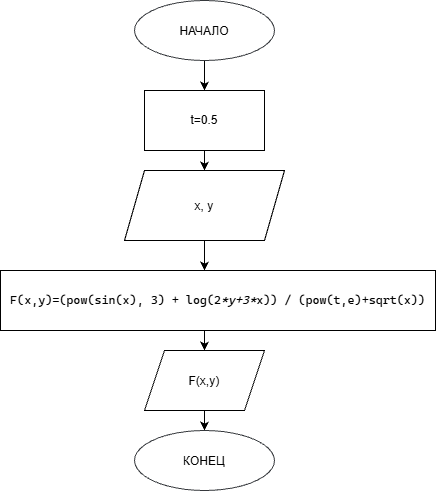

# Домашнее задание к работе 5
## Условие задачи
Написать программу вычисления значения функции двух переменных. Результат проверить на контрольном примере.
F(x, y)=($sin^3$(x)+ln(2y+3x))/($t^e$+√x)
## 1.Алгоритм и блок-схема
1.**Начало**
2.Получение x, y
3.Вычисления
4.Форматированный вывод результата
5.**Конец**

### Блок-схема

## 2.Реализация программы
#define _USE_MATH_DEFINES
#include <stdio.h>
#include <math.h>
#include <locale.h>
#define M_PI 3.14159265358979323846
#define e 2.71828182846
main()
{
#define _USE_MATH_DEFINES
#include <stdio.h>
#include <math.h>
#include <locale.h>
#define M_PI 3.14159265358979323846
#define e 2.71828182846
main()
{
	setlocale(LC_CTYPE, "RUS");
	const double t = 0.5;
	double x;
	double y;
	printf("Введите через запятую значения x и y\n");
	scanf("%lf,%lf", &x, &y);
	double a = sin(x);
	double b = 2 * y + 3 * x;
	double lnb = log(b);
	double c = pow(t, e);
	double korx = sqrt(x);
	double sumznam = c + korx;
	double F = (double)(pow(sin(x), 3) + log(2*y+3*x)) / (pow(t,e)+sqrt(x));

	printf("Функция F(%f, %.7lf)=%.8lf", x, y, F);
	return 0;
}
## 3.Результат выполнения программы
Введите через запятую значения x и y
2,0.0000015
Функция F(2.000000, 0.000002)=1.624082
C:\Users\tihon\source\repos\dzlab5\x64\Debug\dzlab5.exe (процесс 8572) завершил работу с кодом 0 (0x0).
Чтобы автоматически закрывать консоль при остановке отладки, включите параметр "Сервис" ->"Параметры" ->"Отладка" -> "Автоматически закрыть консоль при остановке отладки".
## 4.Информация об авторе
Савченко Тихон бИЦТ-261